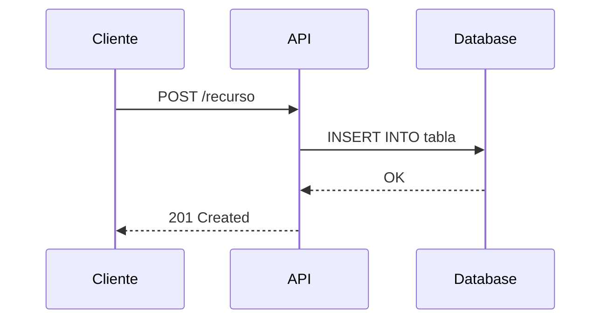

# RFC: [TICKET-ID] Título del RFC

<!--
  ╔══════════════════════════════════════════════════════════════════════════╗
  ║  PLANTILLA MAESTRA DE RFC — Alizia                                      ║
  ║                                                                          ║
  ║  Esta plantilla consolida los patrones de los RFCs existentes:           ║
  ║  - Wizard Cambio de Horario (técnico backend)                            ║
  ║  - Driver Selector (API-heavy, flujos numerados)                         ║
  ║  - Extra Last Mile MLA (operacional, conciso)                            ║
  ║  - Alizia Épicas (producto con épicas)                                   ║
  ║                                                                          ║
  ║  INSTRUCCIONES:                                                          ║
  ║  1. Copiá esta plantilla y renombrá el archivo.                          ║
  ║  2. Completá las secciones relevantes a tu RFC.                          ║
  ║  3. ELIMINÁ las secciones que no apliquen.                               ║
  ║  4. Borrá todos los comentarios HTML cuando el RFC esté listo.           ║
  ║  5. Cada sección está marcada como:                                      ║
  ║     [TÉCNICO]  → Solo para RFCs técnicos/backend                        ║
  ║     [PRODUCTO] → Solo para RFCs de producto/épicas                       ║
  ║     [AMBOS]    → Aplica a cualquier tipo de RFC                          ║
  ╚══════════════════════════════════════════════════════════════════════════╝
-->

<!-- ═══════════════════════════════════════════════════════════════════════
     SECCIÓN: METADATOS [AMBOS]
     Completá toda la tabla de metadatos. Es lo primero que se lee.
     ═══════════════════════════════════════════════════════════════════════ -->

| Campo            | Valor                                      |
|------------------|--------------------------------------------|
| **Ticket**       | [TICKET-ID](link al ticket)                |
| **Autor(es)**    | @nombre1, @nombre2                         |
| **Equipo(s)**    | Equipo A, Equipo B                         |
| **Estado**       | 🟡 Borrador / 🔵 En revisión / 🟢 Aprobado / 🔴 Rechazado / ⚪ Deprecado |
| **Tipo**         | Técnico / Producto / Operacional           |
| **Creado**       | YYYY-MM-DD                                 |
| **Última edición** | YYYY-MM-DD                               |
| **Revisores**    | @revisor1, @revisor2                       |
| **Decisión**     | Pendiente / Aprobada con opción X          |

---

## Historial de versiones [AMBOS]

<!-- Registrá cada cambio significativo. Esto permite entender la evolución del RFC. -->

| Versión | Fecha      | Autor   | Cambios                          |
|---------|------------|---------|----------------------------------|
| 0.1     | YYYY-MM-DD | @nombre | Borrador inicial                 |
| 0.2     | YYYY-MM-DD | @nombre | Incorpora feedback de revisión   |
| 1.0     | YYYY-MM-DD | @nombre | Versión aprobada                 |

---

## Índice

<!--
  Incluí un índice si el RFC es largo (>5 secciones sustanciales).
  Usá los emojis como convención visual:
    ⚙️ Configuración    🔀 Flujos           🧪 A/B Testing
    📈 Rollout          📊 Métricas         🚨 Alertas
    👥 Equipos          📖 Glosario         📝 Tareas
    ⛁  SQL/Schemas      🏗️ Arquitectura     🎯 Objetivos
-->

- [Contexto](#contexto)
- [Problema](#problema)
- [Objetivos](#objetivos)
- [Alcance](#alcance)
- [Propuesta](#propuesta)
- [Alternativas](#alternativas)
- [Épicas](#épicas)
- [Flujos](#flujos-)
- [Configuración](#configuración-️)
- [SQL Schema](#sql-schema-)
- [Dependencias](#dependencias)
- [A/B Testing](#ab-testing-)
- [Rollout](#rollout-)
- [Métricas](#métricas-)
- [Alertas](#alertas-)
- [Equipos](#equipos-)
- [Preguntas](#preguntas)
- [Glosario](#glosario-)
- [Tareas](#tareas-)

---

## Contexto [AMBOS]

<!--
  Describí el contexto del negocio y técnico que motiva este RFC.
  Incluí links a documentos, dashboards o RFCs previos relevantes.
  Sé breve: 2-4 párrafos máximo.
-->

> **Documentos relacionados:**
> - [Link a doc 1](url)
> - [Link a RFC previo](url)
> - [Link a dashboard](url)

Describir el contexto aquí...

---

## Problema [AMBOS]

<!--
  Definí claramente QUÉ problema se está resolviendo.
  Para producto: describí el dolor del usuario.
  Para técnico: describí la limitación o deuda técnica.
-->

Describir el problema aquí...

---

## Objetivos [AMBOS]

<!--
  Listá los objetivos medibles. Usá el formato:
  ✅ Lo que SÍ se busca lograr
  ❌ Lo que explícitamente NO es un objetivo (anti-goals)
-->

### Objetivos

- ✅ Objetivo 1
- ✅ Objetivo 2
- ✅ Objetivo 3

### No-objetivos

- ❌ No-objetivo 1 (razón breve)
- ❌ No-objetivo 2 (razón breve)

---

## Alcance [AMBOS]

<!--
  Definí los límites del RFC. Esto evita scope creep.
  Para producto: qué incluye/no incluye el MVP.
  Usá las etiquetas WIP (trabajo en progreso) y NTH (nice to have) si aplican.
-->

### Incluye (MVP)

- Funcionalidad A
- Funcionalidad B

### No incluye (futuro / NTH)

- Funcionalidad C — NTH
- Funcionalidad D — WIP, se abordará en siguiente iteración

---

## Principios de diseño [PRODUCTO]

<!--
  Reglas que guían las decisiones de diseño en este RFC.
  Omitir si el RFC es puramente técnico y de bajo nivel.
-->

1. **Principio 1** — Descripción breve
2. **Principio 2** — Descripción breve
3. **Principio 3** — Descripción breve

---

## Propuesta [AMBOS]

<!--
  La solución propuesta. Esta es la sección central del RFC.
  Incluí diagramas, código, tablas — todo lo que haga falta para que se entienda.
-->

### Descripción general

Describir la solución propuesta a alto nivel...

### Escenarios / Walkthroughs [TÉCNICO]

<!--
  Describí paso a paso cómo se comporta el sistema en distintos escenarios.
  Patrón del RFC "Wizard Cambio de Horario": pasos numerados con resultado esperado.
-->

#### Escenario 1: [Nombre del escenario]

1. El usuario hace X
2. El sistema consulta Y
3. Se valida Z
4. **Resultado:** Descripción del resultado esperado

#### Escenario 2: [Nombre del escenario]

1. ...

### Componentes involucrados [TÉCNICO]

<!--
  Usá angle brackets para nombres de componentes, como en el RFC "Extra Last Mile MLA".
  Ejemplo: <api-gateway>, <worker-service>, <database>
-->

- `<componente-1>` — Descripción y responsabilidad
- `<componente-2>` — Descripción y responsabilidad
- `<componente-3>` — Descripción y responsabilidad

### Ejemplo de código [TÉCNICO]

<!--
  Incluí snippets de código cuando la propuesta implica cambios concretos.
  Usá comentarios inline para explicar decisiones.
-->

```go
// Ejemplo: nuevo handler para el endpoint propuesto
func HandleRequest(ctx context.Context, req *Request) (*Response, error) {
    // Validamos que el request tenga los campos requeridos
    if err := validate(req); err != nil {
        return nil, err
    }

    // Procesamos según el tipo de operación
    switch req.Type {
    case "create":
        return handleCreate(ctx, req)
    default:
        return nil, ErrUnsupportedType
    }
}
```

### Datos de referencia [TÉCNICO]

<!--
  Tablas con datos que respaldan la propuesta: mapeos, configuraciones, constantes.
  Patrón del RFC "Wizard Cambio de Horario".
-->

| Código | Descripción         | Valor por defecto |
|--------|---------------------|-------------------|
| A01    | Descripción campo A | `true`            |
| B02    | Descripción campo B | `500`             |

### Patrones de configuración JSON [TÉCNICO]

<!--
  Si la propuesta involucra configuraciones en JSON (feature flags, config de clientes, etc.).
  Patrón del RFC "Alizia".
-->

```json
{
  "feature_flag": {
    "enabled": true,
    "rollout_percentage": 10,
    "allowed_clients": ["client_a", "client_b"],
    "config": {
      "param_1": "value",
      "param_2": 100
    }
  }
}
```

---

## Alternativas [AMBOS]

<!--
  Documentá TODAS las alternativas consideradas, incluso las descartadas.
  Cada alternativa con ventajas y desventajas.
  Patrón de "Wizard Cambio de Horario" y "Extra Last Mile MLA".
-->

### Alternativa 1: [Nombre]

Descripción breve de la alternativa...

**Ventajas:**
- ✅ Ventaja 1
- ✅ Ventaja 2

**Desventajas:**
- ❌ Desventaja 1
- ❌ Desventaja 2

### Alternativa 2: [Nombre]

Descripción breve de la alternativa...

**Ventajas:**
- ✅ Ventaja 1
- ✅ Ventaja 2

**Desventajas:**
- ❌ Desventaja 1
- ❌ Desventaja 2

### Alternativa 3: [Nombre]

Descripción breve de la alternativa...

**Ventajas:**
- ✅ Ventaja 1

**Desventajas:**
- ❌ Desventaja 1

### Tabla comparativa de alternativas

<!-- Consolidá la comparación en una tabla para toma de decisión rápida. -->

| Criterio            | Alternativa 1 | Alternativa 2 | Alternativa 3 |
|---------------------|:-------------:|:-------------:|:-------------:|
| Complejidad         | Baja          | Media         | Alta          |
| Tiempo de desarrollo| 2 semanas     | 3 semanas     | 5 semanas     |
| Mantenibilidad      | ✅            | ✅            | ❌            |
| Escalabilidad       | ❌            | ✅            | ✅            |
| Requiere migración  | No            | Sí            | Sí            |

### Opción elegida

<!--
  Indicá claramente cuál es la opción seleccionada y POR QUÉ.
  Patrón del RFC "Extra Last Mile MLA".
-->

> **Opción elegida: Alternativa N**
>
> Justificación: ...

---

## Épicas [PRODUCTO]

<!--
  Para RFCs de producto que definen múltiples épicas.
  Patrón del RFC "Alizia". Cada épica sigue la misma estructura.
  Repetí este bloque por cada épica.
-->

### Épica 1: [Nombre de la épica]

#### Problema

Descripción del problema que resuelve esta épica...

#### Objetivos

- Objetivo 1
- Objetivo 2

#### Alcance MVP

**Incluye:**
- Feature A
- Feature B

**No incluye:**
- Feature C (futuro)

#### Sub-épicas

| Sub-épica          | Descripción                   | Prioridad | Estado     |
|--------------------|-------------------------------|-----------|------------|
| Sub-épica 1.1      | Descripción breve             | Alta      | Pendiente  |
| Sub-épica 1.2      | Descripción breve             | Media     | Pendiente  |

#### Decisiones de cada cliente

<!-- Si las decisiones varían por cliente, documentalo aquí. -->

| Decisión                | Cliente A | Cliente B | Cliente C |
|-------------------------|-----------|-----------|-----------|
| Feature flag habilitado | ✅        | ❌        | ✅        |
| Config custom           | Sí        | No        | Sí        |

#### Decisiones técnicas

- **Decisión 1:** Descripción y justificación
- **Decisión 2:** Descripción y justificación

#### Épicas relacionadas

- [Épica X](link) — Relación: depende de / bloquea / complementa
- [Épica Y](link) — Relación: ...

---

### Épica 2: [Nombre de la épica]

<!-- Repetir la estructura de Épica 1 -->

---

### Patrones transversales [PRODUCTO]

<!--
  Patrones que se repiten entre épicas. Patrón del RFC "Alizia".
  Documentá una vez, referenciar desde cada épica.
-->

| Patrón              | Descripción                          | Aplica a épicas |
|---------------------|--------------------------------------|-----------------|
| Patrón A            | Descripción del patrón               | 1, 2, 3         |
| Patrón B            | Descripción del patrón               | 1, 3            |

---

## Flujos 🔀 [TÉCNICO]

<!--
  Para RFCs API-heavy. Patrón del RFC "Driver Selector".
  Cada flujo tiene: estado, descripción, endpoint, body, parámetros, response, SQL, stream/sink.

  Estados posibles:
    ✅ Realizable  — Listo para implementar
    🟡 Pendiente   — Falta definición
    🔴 Demorado    — Bloqueado por dependencia
    ⚪ Deprecado   — Ya no aplica
    💬 Respondida  — Pregunta resuelta

  Repetí el bloque por cada flujo. Eliminá los campos que no apliquen a cada flujo.
-->

### Flujo 1: [Nombre del flujo]

| Campo       | Valor                |
|-------------|----------------------|
| **Estado**  | ✅ Realizable        |
| **Descripción** | Descripción breve del flujo |

**Endpoint:**

```
POST /api/v1/recurso
```

**Body:**

```json
{
  "campo_1": "valor",
  "campo_2": 123
}
```

**Parámetros:**

| Parámetro  | Tipo     | Requerido | Descripción              |
|------------|----------|-----------|--------------------------|
| campo_1    | `string` | Sí        | Descripción del campo    |
| campo_2    | `int`    | No        | Descripción del campo    |

**Response:**

| Campo      | Tipo     | Descripción              |
|------------|----------|--------------------------|
| id         | `string` | ID del recurso creado    |
| status     | `string` | Estado del procesamiento |

**Response ejemplo:**

```json
{
  "id": "abc-123",
  "status": "created"
}
```

**SQL Queries:**

```sql
-- Query para obtener datos necesarios
SELECT id, campo_1, campo_2
FROM tabla
WHERE condicion = $1
  AND activo = true;
```

**Stream / Sink:**

<!-- Si el flujo publica a un stream o consume de un sink, documentalo aquí. -->

| Tipo   | Nombre          | Formato  | Descripción               |
|--------|-----------------|----------|---------------------------|
| Stream | nombre-stream   | JSON     | Publica evento de X       |
| Sink   | nombre-sink     | Avro     | Consume de Y              |

---

### Flujo 2: [Nombre del flujo]

<!-- Repetir la estructura del Flujo 1 -->

---

## Configuración ⚙️ [TÉCNICO]

<!--
  Feature flags, variables de entorno, configuraciones de infraestructura.
  Patrón del RFC "Driver Selector".
-->

### Feature Flags

| Flag                    | Tipo    | Default | Descripción                        |
|-------------------------|---------|---------|------------------------------------|
| `ff_nombre_feature`     | boolean | `false` | Habilita la nueva funcionalidad    |
| `ff_rollout_percentage` | int     | `0`     | Porcentaje de tráfico habilitado   |

### Variables de entorno

| Variable           | Valor (prod) | Valor (staging) | Descripción              |
|--------------------|-------------|-----------------|--------------------------|
| `API_TIMEOUT_MS`   | `5000`      | `10000`         | Timeout de llamadas HTTP |
| `MAX_RETRIES`      | `3`         | `5`             | Reintentos máximos       |

---

## SQL Schema ⛁ [TÉCNICO]

<!--
  Nuevas tablas, modificaciones a tablas existentes, índices.
  Patrón del RFC "Driver Selector".
-->

### Nuevas tablas

```sql
CREATE TABLE nombre_tabla (
    id          UUID        PRIMARY KEY DEFAULT gen_random_uuid(),
    campo_1     VARCHAR(255) NOT NULL,
    campo_2     INTEGER     DEFAULT 0,
    created_at  TIMESTAMP   NOT NULL DEFAULT NOW(),
    updated_at  TIMESTAMP   NOT NULL DEFAULT NOW()
);

-- Índice para consultas frecuentes por campo_1
CREATE INDEX idx_nombre_tabla_campo_1 ON nombre_tabla (campo_1);
```

### Modificaciones a tablas existentes

```sql
ALTER TABLE tabla_existente
    ADD COLUMN nuevo_campo VARCHAR(100) DEFAULT NULL;
```

### Migraciones

<!-- Indicá el orden de las migraciones y si requieren downtime. -->

| Orden | Migración         | Requiere downtime | Reversible |
|-------|-------------------|-------------------|------------|
| 1     | Crear tabla X     | No                | Sí         |
| 2     | Agregar columna Y | No                | Sí         |
| 3     | Migrar datos      | Sí (estimado: 5m) | No        |

---

## Dependencias [AMBOS]

<!--
  Mapa de dependencias entre componentes, equipos o sistemas.
  Patrón del RFC "Alizia": diagramas ASCII.
  Si preferís, usá Mermaid o links a Excalidraw/Figma.
-->

### Mapa de dependencias

```
┌──────────────┐     ┌──────────────┐     ┌──────────────┐
│  Componente A │────▶│  Componente B │────▶│  Componente C │
└──────────────┘     └──────┬───────┘     └──────────────┘
                            │
                            ▼
                     ┌──────────────┐
                     │  Componente D │
                     └──────────────┘
```

### Dependencias externas

| Dependencia       | Equipo responsable | Estado     | Bloqueante | Notas                  |
|-------------------|--------------------|------------|------------|------------------------|
| API de Servicio X | Equipo Alpha       | ✅ Lista   | Sí         |                        |
| SDK v3.0          | Equipo Beta        | 🟡 En dev  | Sí         | ETA: YYYY-MM-DD        |
| Feature flag Z    | Platform           | ✅ Lista   | No         | Ya disponible en prod  |

---

## A/B Testing 🧪 [AMBOS]

<!--
  Plan de A/B testing para validar la propuesta.
  Patrón del RFC "Driver Selector".
  Omitir si no aplica experimentación.
-->

### Experimento: [Nombre]

| Campo               | Valor                                   |
|---------------------|-----------------------------------------|
| **Hipótesis**       | Si hacemos X, entonces Y mejorará en Z% |
| **Métrica primaria**| Nombre de la métrica                    |
| **Métricas secundarias** | Métrica A, Métrica B               |
| **Tamaño de muestra** | N usuarios / N% del tráfico           |
| **Duración estimada** | N semanas                              |
| **Criterio de éxito** | Mejora >= X% con p-value < 0.05       |

### Variantes

| Variante  | Descripción               | % Tráfico |
|-----------|---------------------------|-----------|
| Control   | Comportamiento actual     | 50%       |
| Treatment | Nueva funcionalidad       | 50%       |

---

## Rollout 📈 [AMBOS]

<!--
  Plan de despliegue progresivo.
  Patrón del RFC "Driver Selector".
-->

| Fase  | % Tráfico | Criterio para avanzar              | Duración estimada | Responsable |
|-------|-----------|------------------------------------|--------------------|-------------|
| 1     | 1%        | Sin errores 5xx por 24h            | 1 día              | @nombre     |
| 2     | 10%       | Métricas estables                  | 2 días             | @nombre     |
| 3     | 50%       | Sin degradación de latencia        | 3 días             | @nombre     |
| 4     | 100%      | Aprobación de producto             | -                  | @nombre     |

### Plan de rollback

<!-- Describí cómo revertir el cambio si algo sale mal. -->

1. Desactivar feature flag `ff_nombre_feature`
2. Verificar que el tráfico vuelve al flujo anterior
3. Monitorear métricas durante 30 minutos post-rollback

---

## Métricas 📊 [AMBOS]

<!--
  Métricas que se van a trackear para evaluar el éxito.
  Patrón del RFC "Driver Selector".
-->

### Métricas de negocio

| Métrica              | Valor actual | Valor esperado | Dashboard link     |
|----------------------|-------------|----------------|--------------------|
| Métrica de negocio 1 | X           | Y              | [link](url)        |
| Métrica de negocio 2 | X           | Y              | [link](url)        |

### Métricas técnicas

| Métrica              | Valor actual | Threshold      | Dashboard link     |
|----------------------|-------------|----------------|--------------------|
| Latencia p99         | Xms         | < Yms          | [link](url)        |
| Error rate           | X%          | < Y%           | [link](url)        |
| Throughput           | X rps       | >= Y rps       | [link](url)        |

---

## Alertas 🚨 [TÉCNICO]

<!--
  Alertas que se van a configurar o modificar.
  Patrón del RFC "Driver Selector".
-->

| Alerta                     | Condición                  | Severidad | Canal de notificación | Runbook         |
|----------------------------|----------------------------|-----------|-----------------------|-----------------|
| Alta tasa de errores       | error_rate > 5% por 5min   | Critical  | #canal-alertas        | [link](url)     |
| Latencia elevada           | p99 > 2000ms por 10min     | Warning   | #canal-alertas        | [link](url)     |
| Cola de mensajes creciente | queue_size > 10000         | Warning   | #canal-alertas        | [link](url)     |

---

## Equipos 👥 [AMBOS]

<!--
  Equipos involucrados, sus responsabilidades y puntos de contacto.
  Patrón del RFC "Driver Selector".
-->

| Equipo            | Responsabilidad                     | Contacto principal | Canal               |
|-------------------|-------------------------------------|--------------------|----------------------|
| Equipo A          | Desarrollo backend                  | @nombre            | #canal-equipo-a      |
| Equipo B          | Desarrollo frontend                 | @nombre            | #canal-equipo-b      |
| Equipo C          | Revisión de seguridad               | @nombre            | #canal-seguridad     |
| Producto          | Definición de requerimientos        | @nombre            | #canal-producto      |

---

## Preguntas [AMBOS]

<!--
  Preguntas abiertas y resueltas. Mantené este log actualizado.
  Patrón del RFC "Driver Selector".

  Estados:
    🟡 Pendiente  — Sin respuesta todavía
    🔴 Demorado   — Esperando input externo
    💬 Respondida — Ya tiene respuesta
-->

| #  | Pregunta                                    | Estado       | Respuesta / Notas              | Responsable |
|----|---------------------------------------------|-------------|--------------------------------|-------------|
| 1  | ¿Se necesita migración de datos?            | 💬 Respondida | Sí, ver sección SQL Schema    | @nombre     |
| 2  | ¿Cuál es el SLA esperado?                   | 🟡 Pendiente |                                | @nombre     |
| 3  | ¿Hay dependencia con el equipo X?           | 🔴 Demorado  | Esperando confirmación         | @nombre     |

---

## Glosario 📖 [AMBOS]

<!--
  Definí términos específicos del dominio o acrónimos usados en el RFC.
  Patrón del RFC "Driver Selector".
  Omitir si todos los términos son bien conocidos por la audiencia.
-->

| Término     | Definición                                                |
|-------------|-----------------------------------------------------------|
| Término 1   | Definición clara y concisa                                |
| Término 2   | Definición clara y concisa                                |
| RFC         | Request for Comments — documento de propuesta técnica     |
| MVP         | Minimum Viable Product — producto mínimo viable           |
| NTH         | Nice to Have — deseable pero no requerido                 |
| WIP         | Work in Progress — trabajo en progreso                    |

---

## Tareas 📝 [AMBOS]

<!--
  Lista de tareas con links a las secciones del RFC.
  Patrón del RFC "Driver Selector": tareas vinculadas a secciones.
  Usá esto para trackear la implementación post-aprobación.
-->

| #  | Tarea                                  | Sección relacionada    | Asignado a | Estado      | Ticket      |
|----|----------------------------------------|------------------------|------------|-------------|-------------|
| 1  | Crear tabla en base de datos           | [SQL Schema](#sql-schema-) | @nombre | ⬜ Pendiente | TICKET-001  |
| 2  | Implementar Flujo 1                    | [Flujos](#flujos-)     | @nombre    | ⬜ Pendiente | TICKET-002  |
| 3  | Configurar feature flag                | [Configuración](#configuración-️) | @nombre | ⬜ Pendiente | TICKET-003  |
| 4  | Configurar alertas                     | [Alertas](#alertas-)   | @nombre    | ⬜ Pendiente | TICKET-004  |
| 5  | Crear dashboard de métricas            | [Métricas](#métricas-) | @nombre    | ⬜ Pendiente | TICKET-005  |
| 6  | Ejecutar rollout fase 1               | [Rollout](#rollout-)   | @nombre    | ⬜ Pendiente | TICKET-006  |

---

## Apéndice [AMBOS]

<!--
  Información de soporte que no cabe en las secciones principales:
  - Diagramas de secuencia completos
  - Logs de ejemplo
  - Capturas de pantalla
  - Cálculos detallados
  - Links a POCs o prototipos

  Omitir si no hay contenido adicional.
-->

### Diagramas adicionales

<!-- Incluí diagramas Mermaid, PlantUML, o links a herramientas externas. -->



### Referencias

- [Documento de diseño previo](url)
- [RFC relacionado](url)
- [Documentación externa](url)

---

<!--
  ╔══════════════════════════════════════════════════════════════════════════╗
  ║  FIN DE LA PLANTILLA                                                    ║
  ║                                                                          ║
  ║  Checklist antes de enviar a revisión:                                   ║
  ║  □ ¿Eliminé las secciones que no aplican?                                ║
  ║  □ ¿Completé todos los campos de metadatos?                              ║
  ║  □ ¿Documenté al menos 2 alternativas?                                   ║
  ║  □ ¿Definí métricas de éxito?                                            ║
  ║  □ ¿Identifiqué dependencias y riesgos?                                  ║
  ║  □ ¿Asigné responsables en la tabla de tareas?                           ║
  ║  □ ¿Borré todos los comentarios HTML de instrucciones?                   ║
  ╚══════════════════════════════════════════════════════════════════════════╝
-->
